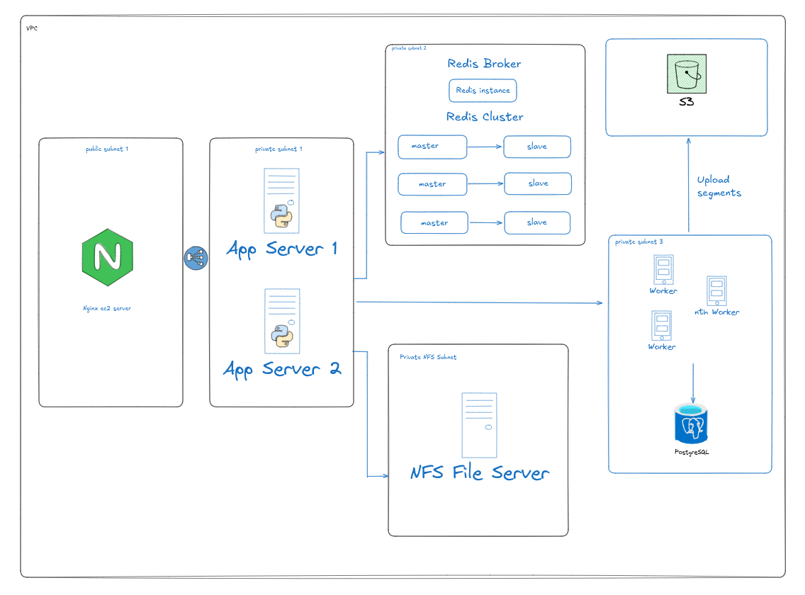

# Distributed Video Streaming System Infra With AWS
This is the completed AWS infrastructure built with Pulumi and Python to deploy the whole system with single command.
This project includes:
- A VPC with public and private subnets.
- Nginx in the public subnet using as the bastion server.
- Rest of the components are in multiple private subnets.
- App servers to handle user api requests.
- A standalone redis server as Celery Broker and redis cluster used.
- S3 bucket used to store segment files
- Worker servers are used to process queue jobs in redis standalone server
- NFS server is used to store video files and segment files temporarily




## Creating S3 bucket
#### Note:
You don't need to create s3 bucket manually if you want to run pulumi scripts.

If you want to run the streaming project locally, then you must need to create an S3 bucket, and you are ready to run the project.
Make sure you name the bucket name : `vidizone-streamer1`

### Bucket Policy To Create S3 Bucket
```
{
    "Version": "2012-10-17",
    "Statement": [
        {
            "Effect": "Allow",
            "Principal": "*",
            "Action": [
                "s3:GetObject",
                "s3:PutObject"
            ],
            "Resource": [
                "arn:aws:s3:::vidizone-streamer1/media/*",
                "arn:aws:s3:::vidizone-streamer1/static/*"
            ]
        }
    ]
}
```

## CORS Policy
```
[
  {
    "AllowedHeaders": ["Authorization", "*"],
    "AllowedMethods": ["GET", "HEAD", "PUT", "POST"],
    "AllowedOrigins": ["*"],
    "ExposeHeaders": ["ETag"],
    "MaxAgeSeconds": 3000
  }
]

```

# Creating AWS services with Pulumi

## Prerequisites


1. **AWS Account:** Ensure you have an active AWS account.
2. **Pulumi CLI:** Install Pulumi from Pulumi's official site.
3. **AWS CLI:** Install AWS CLI and configure it with your Access Key and Secret Key

## Installation

### Step 1: Install Dependencies

1. Clone the repository:
2. Change directory to video-streaming-infra by running

   ```
   git clone https://github.com/BarunBlog/video-streaming-infra
   cd video-streaming-infra
   ```

3. Create and Activate the virtual environment.

   - For linux

     ```
     python3 -m venv myvenv
     source myvenv/bin/activate

     ```

   - For Windows
     ```
     python -m venv myvenv
     myvenv\Scripts\activate
     ```

### Step 2: Set Up Pulumi Project

Initialize the Pulumi project:

```
pulumi login
pulumi stack init dev
```

Set the required AWS region (e.g., ap-southeast-1):

```
pulumi config set aws:region ap-southeast-1
```

Generate the Key pair file:

```
make key-pair
```

### Step 3: Deploy the Architecture

Run the Pulumi up command to create all AWS resources:

```
pulumi up
```

So we created all of our AWS resources required to deploy our project. But before deploy, we need to setup our servers so that they can work properly.

# Server Setup
## Nginx Server setup
### Step 1
- ssh into the bastion server (Nginx).
```
ssh -i MyKeyPair.pem ubuntu@<nginx-public-ip>
```

- Copy the `MyKeyPair.pem` file to the nginx server.
```
scp -i ./MyKeyPair.pem ./MyKeyPair.pem ubuntu@<nginx-public-ip>:~
```
- Now we can ssh to all other private instances from this public nginx server.

### Step 2
- Create a file called `nginx.conf` in the nginx server. And paste all of the content from the project root file `nginx.conf`.
- Don't forget to change the ip addresses of the App server, Flower Server, and the Nginx server.
- Then run all of the commands from `setup_nginx.sh` file in the root directory of the project into The nginx server.
- Nginx Server setup done.

## App Server setup
### Step 1
- From nginx server ssh into App server.
```
ssh -i "MyKeyPair.pem" ubuntu@<app_server_private_ip>
```
- ssh similarly to both app servers.

### Step 2
- install docker before deploying the project.
- Copy all content from `install_docker.sh` in the root directory and paste into both of the app servers to install docker.


## Worker Server setup
### Step 1
- From nginx server ssh into Worker server.
```
ssh -i "MyKeyPair.pem" ubuntu@<worker_server_private_ip>
```
- ssh similarly to both worker servers.

### Step 2
- install docker before deploying the project.
- Copy all content from `install_docker.sh` in the root directory and paste into both of the worker servers to install docker.


## Flower Server setup
### Step 1
- From nginx server ssh into Flower server.
```
ssh -i "MyKeyPair.pem" ubuntu@<flower_server_private_ip>
```

### Step 2
- install docker before deploying the project.
- Copy all content from `install_docker.sh` in the root directory and paste into the server to install docker.


## NFS Server setup
### Step 1
- From nginx server ssh into NFS server.
```
ssh -i "MyKeyPair.pem" ubuntu@<nfs_server_private_ip>
```

### Step 2
- Copy all content from `nfs_server_setup.sh` in the root directory and paste into the server to set the nfs server.

## Database setup
### Step 1
- From nginx server ssh into db server.
```
ssh -i "MyKeyPair.pem" ubuntu@<db_server_private_ip>
```

### Step 2
- Copy all content from `setup_postgres.sh` in the root directory and paste into the server to set the database.


## Redis Broker Server setup
### Step 1
- From nginx server ssh into Redis Broker server.
```
ssh -i "MyKeyPair.pem" ubuntu@<redis_broker_server_private_ip>
```

### Step 2
- Copy all content from `setup_broker_redis.sh` in the root directory and paste into the server to set the Redis Broker server.


## Redis Cluster setup
### Step 1
- From nginx server ssh into each of the Redis cluster nodes.
```
ssh -i "MyKeyPair.pem" ubuntu@<redis_instance1_private_ip>
```
```
ssh -i "MyKeyPair.pem" ubuntu@<redis_instance2_private_ip>
```
```
ssh -i "MyKeyPair.pem" ubuntu@<redis_instance3_private_ip>
```
```
ssh -i "MyKeyPair.pem" ubuntu@<redis_instance4_private_ip>
```
```
ssh -i "MyKeyPair.pem" ubuntu@<redis_instance5_private_ip>
```
```
ssh -i "MyKeyPair.pem" ubuntu@<redis_instance6_private_ip>
```

### Step 2
- For all of the six Redis cluster servers, Copy all content from `setup_redis_instance.sh` in the root directory and paste into the respective servers to set Redis servers.
- Now in the Redis server one, run the `setup_redis_cluster.sh` commands to create the redis cluster. Make sure you change the ip address before running.


So that's it, we completed our AWS server setup. Now it's time for deployment.

# Deployment
- You can Deploy the [Video Streaming Project](https://github.com/BarunBlog/django-video-streaming-project) by using CI/CD that is configured in the project. Make sure you updated the .env file.
- Or you can also clone the project from the App servers, Worker Servers and the Flower server. There you can run these projects by following these commands

## App Server Deployment
1. From App server clone the repository:
2. Change directory to video-streaming-infra by running

   ```
   git clone https://github.com/BarunBlog/django-video-streaming-project
   cd django-video-streaming-project
   ```
3. To run the project, run this command. 
    ```
    sudo docker-compose -f compose.web.prod.yml build
    sudo docker-compose -f compose.web.prod.yml up -d
    ```
4. Do this for both of the App servers.

## Worker Server Deployment
1. From Worker servers Clone the repository:
2. Change directory to video-streaming-infra by running

   ```
   git clone https://github.com/BarunBlog/django-video-streaming-project
   cd django-video-streaming-project
   ```
3. To run the celery, run this command. 
    ```
    sudo docker-compose -f compose.worker.prod.yml build
    sudo docker-compose -f compose.worker.prod.yml up -d
    ```
4. Do this for both of the Worker servers.

## Flower Server Deployment
1. From Flower server clone the repository:
2. Change directory to video-streaming-infra by running

   ```
   git clone https://github.com/BarunBlog/django-video-streaming-project
   cd django-video-streaming-project
   ```
3. To run the flower, run this command. 
    ```
    sudo docker-compose -f compose.flower.prod.yml build
    sudo docker-compose -f compose.flower.prod.yml up -d
    ```
   
So we are all done now.
- To visit app server's admin panel, visit `http://<nginx_server_public_ip>/admin/`.
- To visit flower monitoring interface, visit `http://<nginx_server_public_ip>/flower/`

### Create Superuser Account

To visit the admin interface, you need to create a superuser account from the docker cli. Run the following command from anyone of the app server cli.

```sudo docker exec -it video-streaming-backend python manage.py createsuperuser```